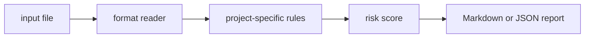

# token-window-planner

`token-window-planner` is a small local CLI that audit LLM prompt assembly plans for token budget and truncation risk.

## Why it is useful

LLM apps fail when prompts silently exceed context windows. This CLI flags assembly plans that lack reserved output or truncation policy.

## Key features

- reads text, JSON, JSONL, or CSV inputs
- returns Markdown or JSON reports
- supports severity-based CI exit codes
- keeps all checks deterministic and offline
- includes focused rules for this project:
- `no-output-reserve`: no output token reserve is declared
- `missing-truncation`: truncation policy is missing
- `near-window-limit`: input token count is close to common context limits

## Installation

```bash
python -m pip install -e ".[dev]"
```

## Usage

```bash
token-window-planner examples/sample.txt
token-window-planner examples/sample.txt --json
token-window-planner path/to/input.txt --fail-on medium --out report.md
python -m token_window_planner --help
```

Example input:

```text
context_window 8192 input_tokens: 8100 reserved_output: 0 truncation: none
```

## CLI options

```text
token-window-planner INPUT [--format auto|text|jsonl|csv|json] [--json]
             [--fail-on low|medium|high] [--out PATH]
```

`INPUT` is any prompt assembly plan or token budget notes. The tool exits with code `2` when findings meet the selected
threshold, which makes it easy to use in GitHub Actions or release checks.

## Workflow



## Tests

```bash
ruff check .
pytest
python -m token_window_planner --help
```

## License

MIT
