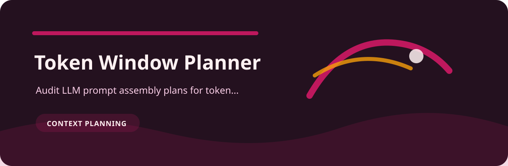

# Token Window Planner

> Audit LLM prompt assembly plans for token budget and truncation risk

This is a review desk for context planning. The useful part is not a dashboard; it is the tiny repeatable moment where vague records become specific findings.

## Finding catalog for `token-window-planner`

| Finding | Level | Why it matters |
| --- | --- | --- |
| `no-output-reserve` | high | no output token reserve is declared |
| `missing-truncation` | medium | truncation policy is missing |
| `near-window-limit` | low | input token count is close to common context limits |

## Try the sample

```bash
git clone https://github.com/mertefekurt/token-window-planner.git
cd token-window-planner
python -m venv .venv
source .venv/bin/activate
python -m pip install -e ".[dev]"
```

```bash
token-window-planner examples/sample.txt
token-window-planner examples/sample.txt --json
```

## Reading the output

- Markdown is meant for humans reviewing a change.
- JSON is meant for CI, scripts, or saved reports.
- `--fail-on` lets the repo decide how strict a gate should be.
