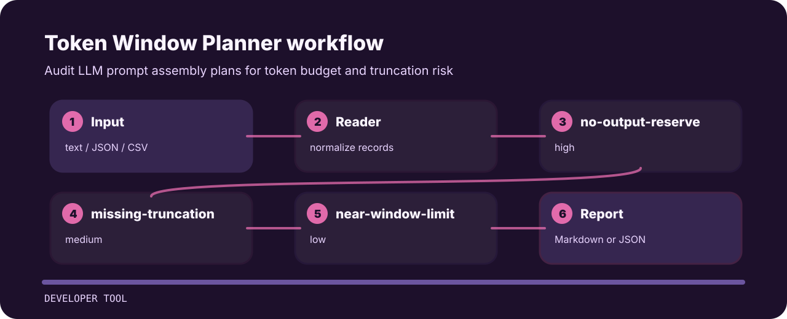

# Token Window Planner


Token Window Planner is meant for quick pull-request checks around context planning. It favors explicit rules over a bulky dashboard.

## Review path



## Rule ledger

| Signal | Level | What it flags | Fix direction |
| --- | --- | --- | --- |
| `no-output-reserve` | high | no output token reserve is declared | Reserve output tokens before adding context. |
| `missing-truncation` | medium | truncation policy is missing | Define deterministic truncation or retrieval cutoff behavior. |
| `near-window-limit` | low | input token count is close to common context limits | Add budget checks and telemetry before production. |

## Local check

```bash
git clone https://github.com/mertefekurt/token-window-planner.git
cd token-window-planner
python -m pip install -e ".[dev]"
token-window-planner examples/sample.txt
```
